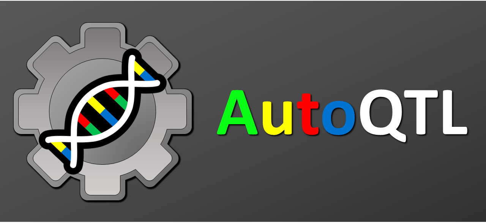

# autoqtl

AutoQTL : Automated Quantitative Trait Locus Analysis
==================================

**AutoQTL** is an automated machine learning tool for QTL Analysis.
The goal of AutoQTL is to automate QTL analysis by building an analytics pipeline optimized for explaining variation in a quantitative trait given a set of genetic variants. It uses Genetic Programming as the search and optimization method. 

#geneticsmeetsautoML

Running AutoQTL
==================================
Anyone interested in AutoQTL can clone the repository and run the autoqtl_test.py file in the 'test' folder in a python environment.
 
We continue to work on to add new features and functionality to AutoQTL and make it available as a python package. 
Suggestions are welcome.

